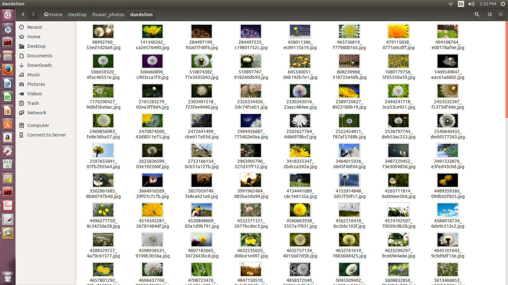
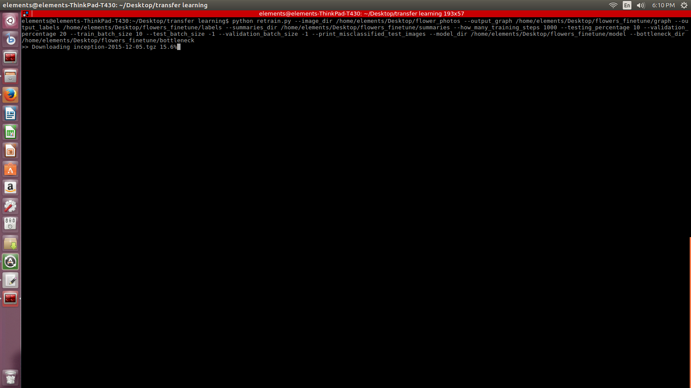
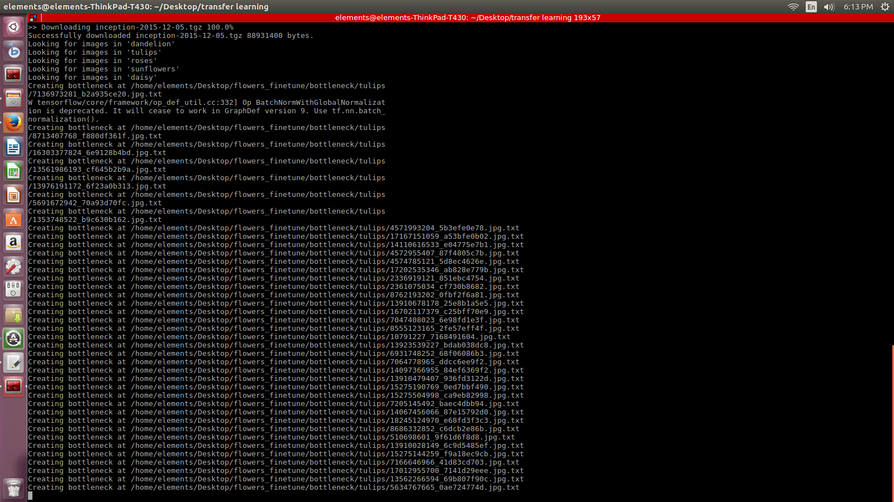
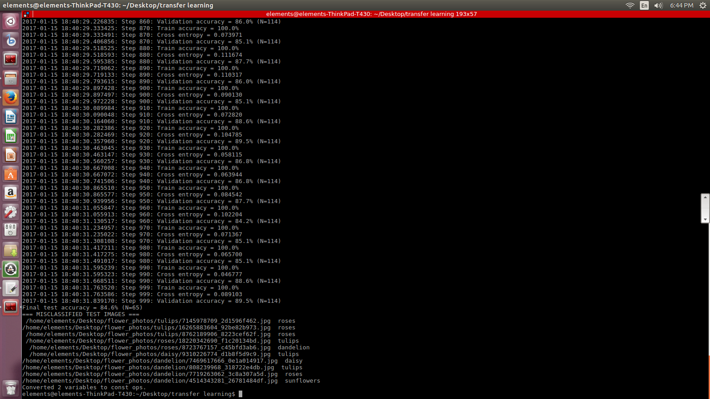
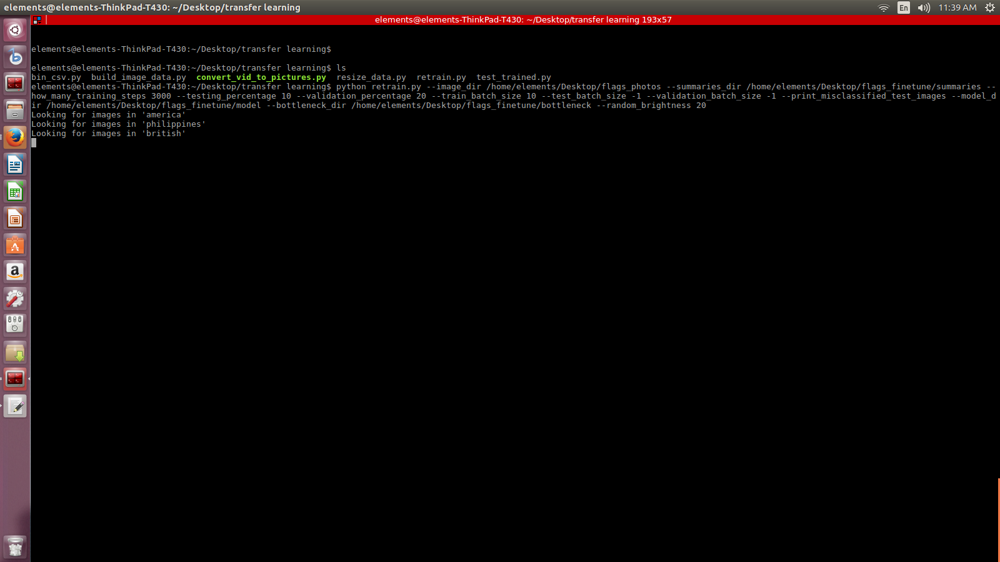
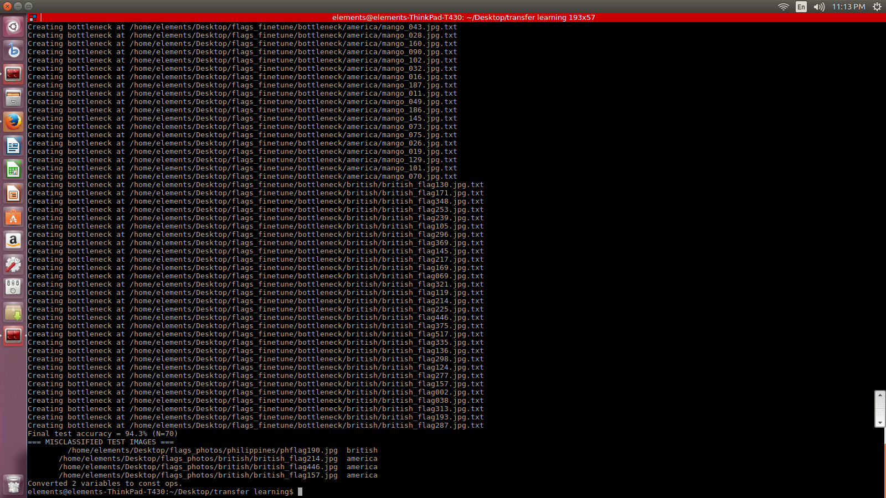
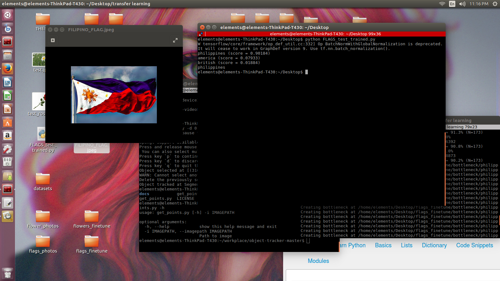

# transferlearning_inceptionv3_model

retraining using flower dataset and my own dataset

# Retraining using the flowers dataset

Obtain the flowers dataset http://download.tensorflow.org/example_images/flower_photos.tgz

run the retrain.py script along, this will also download the inceptionv3 model and its weights.

the script ran for 1 hour, with 1000 training iterations 
and it produced a Final Test accuracy of 84.7%.

# Retraining using my own dataset

I chose 3 different flags to classify british, american and the philippines flag. 

same process, made this one tun through 530 steps.

here are the results.

final results and misclassified 4 images. test_trained.py script can be used on a single image to test the produced model.

